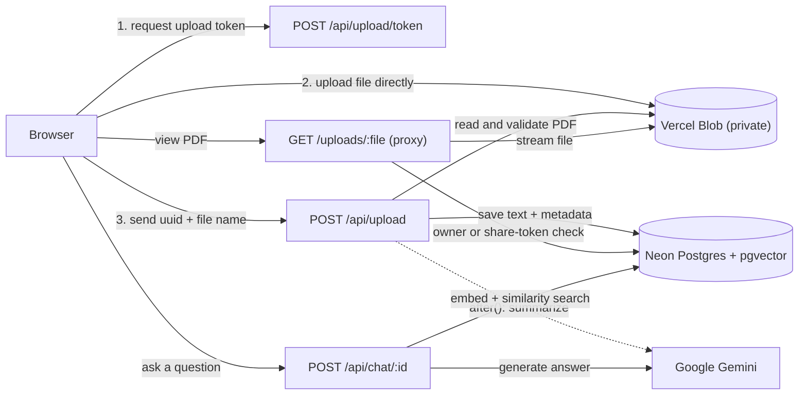

# PDF Intelligence

Chat with your PDFs. Upload a document, get an AI summary, ask questions grounded in its text, and share it through revocable guest links.

**Live demo:** https://pdf-intelligence-sigma.vercel.app
(Sign up with email and password, or continue with Google.)

## Features

- **Direct-to-storage uploads.** PDFs (up to 10 MB) go from the browser straight to a private Vercel Blob store, so file size is not limited by serverless request bodies.
- **Accurate text extraction.** Text is extracted with `unpdf` (built on PDF.js). For table-heavy documents (receipts, mark sheets, forms) the extractor rebuilds rows from x/y positions instead of relying on flattened text order, which avoids labels and values getting mismatched.
- **AI summaries.** Generated in the background after upload, with a visible status (`PENDING`, `GENERATING`, `DONE`, `FAILED`) and a retry button on failure.
- **Chat with your document.** Streaming answers from Google Gemini. Short documents are sent to the model in full; long documents use retrieval-augmented generation (chunk, embed, pgvector similarity search).
- **Secure sharing.** Share a document through a link that can be revoked at any time. Guests can view the PDF, chat, and comment without an account.
- **Authentication.** Email and password (bcrypt) plus Google OAuth, via NextAuth.
- **Private files.** Blob URLs are never sent to the browser. Every file request goes through an authorization proxy.

## How it works



## Tech stack

| Area | Technology |
|---|---|
| Framework | Next.js 16 (App Router), React 19, TypeScript |
| Styling | Tailwind CSS |
| Database | PostgreSQL on Neon with the `pgvector` extension |
| ORM | Prisma 7 with `@prisma/adapter-pg` |
| Auth | NextAuth v4 (credentials and Google OAuth) |
| File storage | Vercel Blob (private store) |
| AI | Google Gemini for chat, summaries and embeddings (`gemini-embedding-001`); Ollama supported for local development |
| PDF text extraction | `unpdf` |
| Hosting | Vercel (Hobby plan) |

## Design decisions

- **Private Blob + authorization proxy.** The Blob store is private, and its URLs are never exposed to the client. `/uploads/[filename]` looks up the document, allows only the owner (session) or a valid, non-revoked share token, then streams the file from Blob. Opening a raw blob URL returns 403.
- **Client uploads.** Vercel Functions cap request bodies at 4.5 MB. The browser therefore uploads directly to Blob using a short-lived token, and the server validates the result afterwards.
- **Server-side validation.** The token route checks the session and only allows `pdfs/<userId>/<uuid>.pdf` paths, PDFs only, 10 MB maximum. The creation route re-validates the path, checks the actual blob size and the `%PDF-` header, and creates each document only once per upload.
- **Background summaries.** Summaries run inside `after()` so the upload response returns as soon as the document is saved.
- **Lazy, resumable embeddings.** Long documents are chunked and embedded on the first question, and progress is saved so a retry resumes where it stopped. The first question on a large document is slower; later ones are fast.
- **Fail clearly on scanned PDFs.** There is no OCR. Image-only PDFs are rejected with an explanatory message, and nothing is stored.

## Getting started (local)

**Prerequisites:** Node.js 22, a PostgreSQL database with the `vector` extension (Neon works well), a Gemini API key, Google OAuth credentials, and a Vercel account for the Blob store.

```bash
git clone https://github.com/V-Ajay-Chandra-24/pdf-intelligence-app.git
cd pdf-intelligence-app
npm install          # also runs `prisma generate`
cp .env.example .env # then fill in the values below
```

Enable pgvector once, then apply the migrations:

```sql
CREATE EXTENSION IF NOT EXISTS vector;
```

```bash
npx prisma migrate deploy
npm run dev
```

**Blob storage locally:** create a **Private** Blob store in the Vercel dashboard and connect it to your project, including the **Development** environment (Store, then Projects, then Update Project Connection). Then run `vercel link` and `vercel env pull .env.local` to get the Blob credentials.

**Google OAuth locally:** add `http://localhost:3000/api/auth/callback/google` as an authorized redirect URI.

## Environment variables

| Variable | Description |
|---|---|
| `DATABASE_URL` | Postgres connection string. Use Neon's pooled host (`-pooler`) on Vercel. |
| `NEXTAUTH_URL` | Public URL of the app, for example `https://pdf-intelligence-sigma.vercel.app` |
| `NEXTAUTH_SECRET` | Random secret for NextAuth (`openssl rand -base64 32`) |
| `GOOGLE_CLIENT_ID`, `GOOGLE_CLIENT_SECRET` | Google OAuth credentials |
| `LLM_PROVIDER` | `gemini` (production) or `ollama` (local). Defaults to `ollama` if unset. |
| `GEMINI_API_KEY` | Google Gemini API key |
| `GEMINI_CHAT_MODEL` | Gemini model used for chat and summaries |
| `GEMINI_EMBED_MODEL` | Gemini embedding model (`gemini-embedding-001`) |
| `BLOB_READ_WRITE_TOKEN` | Added automatically when a Blob store is connected. Required to sign client uploads. |
| `BLOB_STORE_ID` | Added automatically when a Blob store is connected |
| `FULL_CONTEXT_TOKEN_THRESHOLD_GEMINI` | Optional. Estimated token count above which retrieval is used instead of full-context mode. |
| `OLLAMA_BASE_URL`, `OLLAMA_MODEL` | Optional, for local Ollama |

## Deploying to Vercel

1. Import the repository and set the environment variables above (leave `NEXTAUTH_URL` until you know the final domain).
2. Under **Storage**, create a **Private** Blob store and connect it to the project. The access mode cannot be changed later.
3. Set `NEXTAUTH_URL` to the production domain and redeploy.
4. Under **Settings, Functions**, pick a region close to your database and keep Fluid compute enabled. Hobby functions have a 300 second maximum duration, which the upload and chat routes are configured to use.
5. In Google Cloud Console, add the production origin and the redirect URI `https://<your-domain>/api/auth/callback/google`, and set the OAuth consent screen to **In production** so anyone can sign in.

Database migrations are run manually (`npx prisma migrate deploy`), not during the Vercel build.

## Limitations

- Scanned or image-only PDFs are not supported (no OCR).
- Files are limited to 10 MB, and each account can store up to 25 documents.
- The per-user chat rate limit is in memory, so it is best-effort on serverless. Gemini's own quotas are the real limit.
- Free-tier Gemini quotas can throttle very large documents.

## Project structure

```
src/
  app/
    api/
      upload/            creates the document after a client upload
      upload/token/      issues client upload tokens for private Blob
      chat/[documentId]/ streaming chat (full-context or RAG)
      documents/[id]/    document deletion (database row and blob)
    uploads/[filename]/  authorization proxy that streams PDFs from Blob
    dashboard/           signed-in workspace and PDF viewer
    shared/[token]/      guest view for share links
  components/            UI (upload modal, chat panel, comments, share manager)
  lib/
    auth.ts              NextAuth configuration
    prisma.ts            Prisma client (pg adapter, small pool for serverless)
    storage.ts           Vercel Blob helpers and path validation
    llm/                 Gemini and Ollama providers, RAG (chunk, embed, search)
    jobs/summarize.ts    background summary job
prisma/                  schema and migrations
```